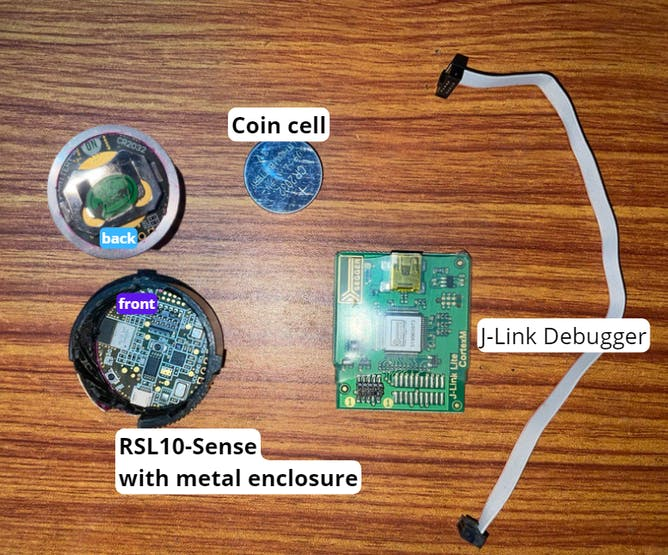

**RSL10-based Monitoring of Compressor Water Pump Condition**

Applying RSL10 and Bosch sensors to run a TinyML model for predictive
maintenance of compressor water pumps.

Hardware: onsemi RSL10-SENSE-GEVK\
Software Neuton Tiny ML Neuton, OnSemi IDE

**Introduction**

An ordinary resident of a metropolis rarely thinks about how water
enters taps or central heating pipes, and may not even have an idea of
what a compressor water pump looks like. But in reality, it's hard to
picture life without water pumps as no one likes not being able to take
a hot shower in the morning, after all.

In some countries, the situation is even more acute. I'm from the
Jharkhand state of India, and in some places, access to processed
potable water is very difficult so people have to rely on underground
water. In such cases, water pumps are the only option. But ordinary men
don\'t have the skills, time, and know-how for water pump maintenance,
and if heavy wear and tear occurs, people have to wait for almost a week
for the pump to be repaired.

Like any other machines, water pumps should undergo maintenance and
repairs. Instead of taking reactive measures when the damage has already
happened, people can make use of **ML-based predictive maintenance**
that will help to avoid any severe issues and extend the life of a
compressor pump.

With RSL10 sensors and Neuton AI, I've built a fast scalable solution
for compressor water pump predictive maintenance. Upkeeping of such
pumps requires lubricating, cleaning, changing air filters, and
inspecting the machine for potential problems, so it's important to
address any potential concerns before they cause serious issues.

### **Predictive Maintenance VS Reactive Maintenance?**

Predictive maintenance is a type of **troubleshooting** that addresses
needs before they turn into problems. This process helps you prevent
equipment breakdowns rather than waiting until a concern reveals itself.

{}

Reactive maintenance requires far less forethought but can cost a lot.
Predictive maintenance requires more planning, but it can pay off in big
ways, as we'll see. Of course, it's not possible to predict every
problem, but you can avoid a lot of unexpected machinery issues.

**Importance of water pumps**

Water pumps have several areas of use: residential, industrial, and
commercial, depending on their features. But, the functions of all these
pumps remain the same -- they all transport water and other liquids from
one place to another.



In this project, I used **RSL10, the industry's lowest power Bluetooth®
5 SoC, and several sensors from ON Semiconductor and Bosch**.


**Key Features**

-   Arm® Cortex®−M3 Processor Clocked at up to 48 MHz

-   Supply Voltage Range: 1.1 − 3.3 V

-   384 kB of Flash Memory

-   76 kB of Program Memory

-   88 kB of Data Memory

-   \~10 yrs battery operation on deep sleep mode

**Advanced Wireless features:**

-   Bluetooth 5.2 Certified with LE 2−Mbit PHY (High Speed), as well as
    > Backwards Compatibility and Support for Earlier

-   Supports FOTA (Firmware Over−The−Air) Updates

-   Rx Sensitivity (Bluetooth Low Energy Mode, 1 Mbps): −93 dB

-   Transmitting Power: −17 to +6 dBm

-   Range up to 100 Meters

### **Sensor Fusion**

Sensor fusion is the process of combining
[sensor](https://en.wikipedia.org/wiki/Sensor) data or data derived from
disparate sources so that the resulting
[information](https://en.wikipedia.org/wiki/Information) can be more
accurate. Sensor fusion creates a situation in which the whole is much
greater than the sum of its parts. These mechanisms provide a way to
resolve contradictory situations and allow the development of dynamic
sensing strategies. Sensor fusion is also known as (multi-sensor) [data
fusion](https://en.wikipedia.org/wiki/Data_fusion) and is a subset of
[information
fusion](https://en.wikipedia.org/wiki/Information_integration).

> *The concept of data fusion has origins in the evolved capacity of
> humans and animals to incorporate information from multiple senses to
> improve their ability to survive. For example, a combination of sight,
> touch, smell, and taste may indicate whether a substance is edible.*

Sensor fusion, machine learning, and connectivity enable context
awareness, and context awareness enables a new generation of services.

### **What is Context?**

Context is defined as the circumstances or facts that form the setting
for an event, statement, situation, or idea. In software programming,
the idea of developing context-aware applications has been around for a
while. Context-aware apps examine who, where, when, and what. The
software designer uses this contextual information to determine why a
situation is happening and then encodes some action in the application.


Based on this definition, the four most important categories of
information to formulate a context-aware action are:

-   Identification

-   Location

-   Time

-   Activity

### **Procedure**

### 

### **Step 1: Data Collection**


As shown above, we are going to set up our data collection stage for our
compressor water pump with RSL10 device sensors. To do so, we need to
configure our IDE for programming first.

1\. Visit the website
<https://www.onsemi.com/products/wireless-connectivity/wireless-rf-transceivers/rsl10-sip>
and download the required IDE and SDK packages.


2\. Follow this official manual for importing the CMSIS pack in the
OnSemi IDE. <https://www.onsemi.com/pub/collateral/evbum2614-d.pdf>

3\. Copy the BH160 Sensor Hub example in your workspace.


4\. We can modify the example code to build a dataset for our project.


**Hardware Setup**


**Add an image**

**Delete this image**

The pump heats so I tried to use a rough enclosure to protect the RSL10
sensor board from any damage. Once the setup is complete, we are ready
to print all the sensor values and prepare our dataset.

```c
> printf(\"%.2f, %.2f, %.2f, %.2f, %.2f, %.2f, %.2f, %.2f, %.2f, %.2f,
> %.2f, %.2f \\n\", sensorFusion.h, sensorFusion.p, sensorFusion.b,
> sensorFusion.xlinear, sensorFusion.ylinear, sensorFusion.zlinear,
> sensorFusion.xrotate, sensorFusion.yrotate, sensorFusion.zrotate,
> sensorFusion.pressure, sensorFusion.temperature,
> sensorFusion.humidity);
```


The sensor values would be printed on the J-Link RTT Viewer.

Once we are ready with the data collection part, we will proceed to
training a Neuton model and running inference.


Check our dataset summary:


**Add an image**

**Delete this image**

### **Step 2: Model Training**

On the Neuton platform, upload your dataset and select \'output\' as the
target variable.


We can select training types: classification or regression. For
predictive maintenance, a regression model can help to predict future
target variables like machine efficiency based upon sensor fusion. But
for this project, I chose the classification type of task.

{}

Toggle the DSP option and select Windows size auto selection and start
training.


Once the training is complete, we can explore variable-to-target
relation features and data analysis charts.


The training looks good and we will download the generated TinyML model
C library to use on our RSL10 board IDE. Our model has ***100% accuracy,
only 39 Coefficients, and a 0.17 Kb Model Size***.


Click on the "Download" button.


### **Step 3: Model deployment and Inference**

We will place all our header files in the include folder and C files in
the src folder for the downloaded Neuton TinyML C library, see below.


The important function here is *neuton_model_set_inputs(inputs)*, in
which all sensor values are fed. Once the buffer is full of the
function, it returns 0 and is ready for inference.


Build your project: the build writes .elf binary file, which is to be
flashed on the RSL10 device through J-Link Debugger.


Set the build configurations for the RSL10 device, and proceed to the
"Run" button to flash the RSL10 board.


The console should log the following output:

SEGGER J-Link GDB Server V7.58b Command Line Version

JLinkARM.dll V7.58b (DLL compiled Nov 16 2021 15:00:10)

Command line: -if swd -device RSL10 -endian little -speed 1000 -port
2331 -swoport 2332 -telnetport 2333 -vd -ir -localhostonly 1 -singlerun
-strict -timeout 0 -nogui

```
\-\-\-\--GDB Server start settings\-\-\-\--
GDBInit file: none
GDB Server Listening port: 2331
SWO raw output listening port: 2332
Terminal I/O port: 2333
Accept remote connection: localhost only
Generate logfile: off
Verify download: on
Init regs on start: on
Silent mode: off
Single run mode: on
Target connection timeout: 0 ms
\-\-\-\-\--J-Link related settigs\-\-\-\-\-
J-Link Host interface: USB
J-Link script: none
J-Link settings file: none
\-\-\-\-\--Target related settings\-\-\-\-\--
Target device: RSL10
Target interface: SWD
Target interface speed: 1000kHz
Target endian: little
Connecting to J-Link\...
J-Link is connected.
Firmware: J-Link Lite-Cortex-M V9 compiled Feb 2 2021 16:33:27
Hardware: V9.00
S/N: 519003973
Feature(s): GDB
Checking target voltage\...
Target voltage: 2.58 V
Listening on TCP/IP port 2331
Connecting to target\...
Connected to target
Waiting for GDB connection\...Connected to 127.0.0.1
Reading all registers
Read 4 bytes @ address 0x00000000 (Data = 0x20002000)
Read 2 bytes @ address 0x00000000 (Data = 0x2000)
Received monitor command: speed 1000
Target interface speed set to 1000 kHz
Received monitor command: clrbp
Received monitor command: reset
Resetting target
Received monitor command: halt
Halting target CPU\...
\...Target halted (PC = 0x00100158)
Received monitor command: regs
R0 = 00100159, R1 = 00000007, R2 = 20008000, R3 = E000ED00
R4 = 00100000, R5 = 00000007, R6 = FFFFFFFF, R7 = 40000E2C
R8 = 4200A700, R9 = 00081A00, R10= BD648BE7, R11= 99F19BFF
R12= 00000001, R13= 20007FFC, MSP= 20007FFC, PSP= 37EBBDB8
R14(LR) = 000002E5, R15(PC) = 00100158
XPSR 61000000, APSR 60000000, EPSR 01000000, IPSR 00000000
CFBP 00000001, CONTROL 00, FAULTMASK 00, BASEPRI 00, PRIMASK 01
Security extension regs:
MSP_S = 00000000, MSPLIM_S = 00000000
PSP_S = 00000000, PSPLIM_S = 00000000
MSP_NS = 20007FFC, MSPLIM_NS = 00000000
PSP_NS = 37EBBDB8, PSPLIM_NS = 00000000
CONTROL_S 00, FAULTMASK_S 00, BASEPRI_S 00, PRIMASK_S 00
CONTROL_NS 00, FAULTMASK_NS 00, BASEPRI_NS 00, PRIMASK_NS 01
Reading all registers
Received monitor command: speed auto
Select auto target interface speed (2000 kHz)
Received monitor command: flash breakpoints 1
Flash breakpoints enabled
Received monitor command: semihosting enable
Semi-hosting enabled (Handle on BKPT)
Received monitor command: semihosting IOClient 1
Semihosting I/O set to TELNET Client
Received monitor command: SWO DisableTarget 0xFFFFFFFF
SWO disabled successfully.
Received monitor command: SWO EnableTarget 0 0 0x1 0
SWO enabled successfully.
Downloading 16112 bytes @ address 0x00100000 - Verified OK
Downloading 16048 bytes @ address 0x00103EF0 - Verified OK
Downloading 16032 bytes @ address 0x00107DA0 - Verified OK
Downloading 16016 bytes @ address 0x0010BC40 - Verified OK
Downloading 16016 bytes @ address 0x0010FAD0 - Verified OK
Downloading 14888 bytes @ address 0x00113960 - Verified OK
Downloading 8 bytes @ address 0x00117388 - Verified OK
Downloading 548 bytes @ address 0x00117390 - Verified OK
Received monitor command: clrbp
Received monitor command: reset
Comparing flash \[\...\...\...\...\...\.....\] Done.
Erasing flash \[\...\...\...\...\...\.....\] Done.
Programming flash \[\...\...\...\...\...\.....\] Done.
Resetting target
Received monitor command: halt
Halting target CPU\...
\...Target halted (PC = 0x00100158)
Received monitor command: regs
R0 = 00100159, R1 = 00000007, R2 = 20008000, R3 = E000ED00
R4 = 00100000, R5 = 00000007, R6 = FFFFFFFF, R7 = 40000E2C
R8 = 4200A700, R9 = 00081A00, R10= BD648BE7, R11= 99F19BFF
R12= 00000001, R13= 20007FFC, MSP= 20007FFC, PSP= 37EBBDB8
R14(LR) = 000002E5, R15(PC) = 00100158
XPSR 61000000, APSR 60000000, EPSR 01000000, IPSR 00000000
CFBP 00000001, CONTROL 00, FAULTMASK 00, BASEPRI 00, PRIMASK 01
Security extension regs:
MSP_S = 00000000, MSPLIM_S = 00000000
PSP_S = 00000000, PSPLIM_S = 00000000
MSP_NS = 20007FFC, MSPLIM_NS = 00000000
PSP_NS = 37EBBDB8, PSPLIM_NS = 00000000
CONTROL_S 00, FAULTMASK_S 00, BASEPRI_S 00, PRIMASK_S 00
CONTROL_NS 00, FAULTMASK_NS 00, BASEPRI_NS 00, PRIMASK_NS 01
Reading all registers
> Starting target CPU\...
``` 

To see the output, we can either use the J-Link RTT Viewer or Eclipse
IDE terminal viewer. Let\'s use Terminal in Eclipse OnSemi IDE.


**Add an image**

**Delete this image**

We can see the inference output on the terminal:


*The Neuton TinyML model and RSL10 device have proved to be a working
mission-critical solution for the compressor pumps industry. With such
accurate and reliable* *tinyML models, there is still ample space left
for all other networking and DSP operations. The inference is faster
than any* *existing tinyML solutions.*

😞 **Comparison with TensorFlow Lite for MCU?**

Although I planned to draw a comparison, I found that RSL10 SDK does not
support C++, hence we cannot run TensorFlow Lite models on this device.

### **Conclusion**

Through this project, I showcased how such tiny sensor-rich low-powered
devices can improve lives for the better. Predictive maintenance of
compressor water pumps can really save much money for the common man,
farmers, and even companies.
